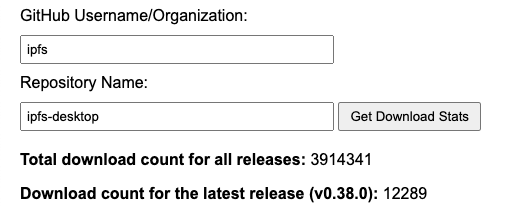

# github-release-download-stats



Include `script.js` or copy the `getDownloadCounts` function into your code.

```javascript
// Call the function with desired parameters
getDownloadCounts('ipfs', 'ipfs-desktop')
  .then((counts) => {
    // Use the counts in your application
    document.getElementById('totalDownloads').textContent = counts.total;
    document.getElementById('latestDownloads').textContent = counts.latest;
    document.getElementById('latestTag').textContent = counts.latestTag;
  })
  .catch((error) => {
    // Handle errors
    console.error('Error fetching download counts:', error);
  });
```
